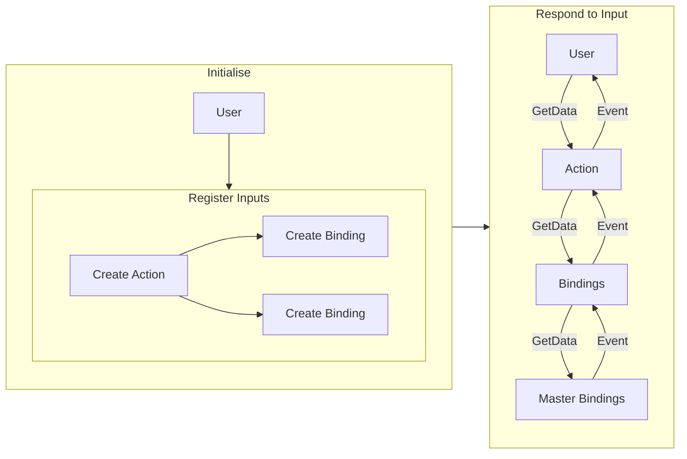

The ECSE Input System follows an action mapping design pattern, allowing for versatile functionality and trivial support for multiple forms of input. The system is built to be versatile and modifiable before and at runtime while still maintaining a clean and easy to understand API.

The input system's API is entirely accessible through the include `modules/input/input.h`.

---
## Logical Flow


---
## Master Bindings
The foundation of the input system is formed by [[MasterBinding|Master Bindings]]. These define all the data and functionality related to their input. Master Bindings are not intended to be directly interfaced with by the user, though it is technically possible to obtain or forcefully update their underlying data cache. Though uncommon, Master Bindings also support [[Processor|Processors]].

A Master Binding contains information about the underlying input's output data type and its precision. This information is used for run time type validity checks and can be accessed either directly through the Master Binding or through any of its instances.

---
## Binding Instances
[[BindingInstance|Binding Instances]] can be considered children of Master Bindings. Each instance is bound to a single [[Action]] or [[CompositeBinding|Composite Binding]] and provides its bound object with an interface for accessing its input data. Similar to Master Bindings, instances also support Processors.

Binding Instances are typically created through the following functions:^[Note: the bound action must be of the same type as the instance.]
```cpp
BindingInstance* ecse::input::CreateBinding(Action* bindTo, Key key);
BindingInstance* ecse::input::CreateBinding(Action* bindTo, Mouse mouse);
```

---
## Actions
[[Action|Actions]] are the primary interface for the user. Actions define a set of events `OnStart`, `OnRepeat`, and `OnEnd` as well as a template GetData function to allow for polling the Action's inputs. Additionally, Actions support their own Processors like both prior forms of bindings.

### Creating Actions
Actions should be created via the following:^[Note: both r-value reference and l-value reference strings are accepted via overload.]
```cpp
Action* ecse::input::CreateAction(std::string& name, Output dataType, Precision precision = Precision::Double);
```
The parameter `name` defines a unique (not shared by any other action) identifier, `dataType` describes the component count of the Action (Scalar, Vector2, or Vector3), and `precision` describes the stride of each component (Single, or Double).

Once created the engine assumes ownership of the Action and as such the pointer should not be used to deallocate memory.

### Callbacks
At the beginning of each frame, input events are gathered and dispatched to the system. Relevant bindings receive these events and pass them upwards to their bound action, triggering the associated callback. `OnStart` is triggered on the first frame an input is detected to be actuated, `OnRepeat` is triggered once per frame afterwards while actuated, and `OnEnd` is triggered once the input is released.

All three events provide an [[InputEventData|Input Event Data]] object, providing access to the current value of the input as well as the triggering action and any modifier keys that were held.

#### Example
```cpp
// Initialise somewhere
ecse::input::GetAction("Jump").OnStart.Register(OnJump);

void OnJump(InputEventData& eventData)
{
	// Jump!
}
```

### Polling
Actions can also be manually polled through their GetData method. This method returns a copy of the input's value at the time of polling with processing applied.^[Note: while the poll is guaranteed to be accurate within the frame, due to caching it is technically possible to obtain a false negative or false positive result if the input was respectively actuated or released after the first poll in a frame.]
#### Example
```cpp
bool isSprinting = ecse::input::GetAction("Sprint").GetData<float>() > 0;
```

## Composite Bindings
[[CompositeBinding|Composite Bindings]] are a unique type of binding that fetches its data from multiple other bindings to form a larger type. For example, using regular bindings you would need 4 different actions to create a movement using the WASD keys. With a composite binding you're able to combine those into a vector2 under a single action. To allow for this, attached bindings are stored within `Constituent` objects which holds the binding and informs its impact on the composite. 

Like regular bindings, composites support processors themselves, as well as within their attached binding instances.

### Creation
Creating composites is necessarily somewhat more verbose than simple binding instances and involves two functions:
`CreateCompositeBinding` - Builds and binds the composite itself.
`CreateConstituent` - Builds individual constituents for the above function.

Here's an example of the aforementioned WASD binding using an action context:
```cpp
ecse::Input::CreateCompositeBinding(ecse::Input::Output::Vector2, ecse::Input::Precision::Single,
{
	ecse::Input::CreateConstituent(ecse::Input::Key::A, { ecse::Input::Component::NegX }),
	ecse::Input::CreateConstituent(ecse::Input::Key::D, { ecse::Input::Component::PosX }),
	ecse::Input::CreateConstituent(ecse::Input::Key::S, { ecse::Input::Component::NegY }),
	ecse::Input::CreateConstituent(ecse::Input::Key::W, { ecse::Input::Component::PosY })
});
```

Note that the final argument of `CreateCompositeBinding` is an `std::vector<Constituent>&&` and as such must be provided as an r-value reference.^[This may change in the future.]

#### Constituent
`CreateConstituent` takes two parameters: the first is the input for the binding, and the second is an `std::vector<Component>` which describes how the binding interacts with the composite. Internally, the composite's memory is zeroed before polling and all constituents are added to their relevant values.

Any constituent component prefixed with `Neg`  is negated before being applied to its value, while `Pos` is added as is. Notably this means that inputs whose expected output is negative will have the opposite effect on the composite.^[This is currently intended and it is recommended to use binding processors on the constituents if this poses a problem. Future iteration may include an option to use absolute signs.]

### Polling and Events
Composite bindings currently support polling identically to Binding Instances. Their constituents are able to recieve events that will update their data accordingly, but these events do not bubble up through the composite.^[This is a planned improvement]